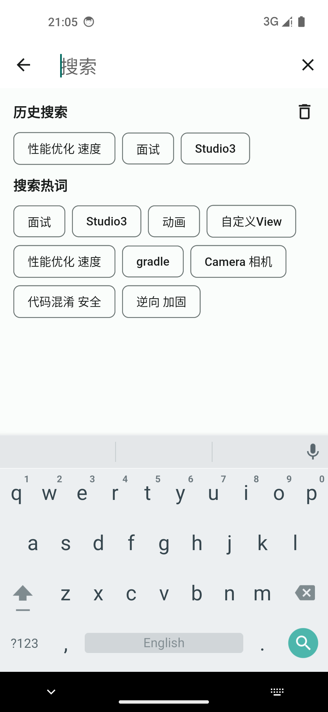

# wan_android_flutter

## 项目介绍

本项目是一个使用 Flutter 开发的跨平台移动应用程序，以下是项目的主要特点和技术栈：

- **主要使用 Provider + Dio 开发：** 采用了 Provider 和 Dio 这两个强大的库来管理状态和进行网络请求。Provider 提供了一个便捷的状态管理解决方案，而 Dio 则是一个功能强大的 HTTP 客户端。

- **采用 Material Design 3 主题：** 应用程序的设计风格遵循 Material Design 3，这是 Google 最新的设计语言，提供了更加现代和流畅的用户界面体验。

- **国际化：** 使用 easy_localization 库实现了国际化功能。

## 应用截图

|  |  |  |  |
|----------------------------------------|----------------------------------------|--------------------------------------------|--------------------------------------------|
|  |  |      |      |
|  |  |      |    |
|  | |                                            |                                            |